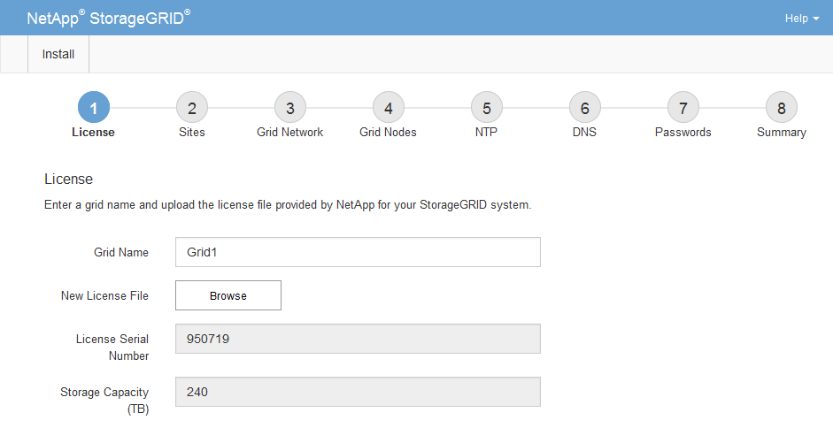

= Specifying the StorageGRID license information
:icons: font
:imagesdir: ../media/

[.lead]
You must specify the name for your StorageGRID system and upload the license file provided by NetApp.

.Steps

. On the License page, enter a meaningful name for your StorageGRID system in *Grid Name*.
+
After installation, the name is displayed at the top of the Nodes menu.

. Click *Browse*, locate the NetApp License File (`NLFunique_id.txt`), and click *Open*.
+
The license file is validated, and the serial number and licensed storage capacity are displayed.
+
NOTE: The StorageGRID installation archive includes a free license that does not provide any support entitlement for the product. You can update to a license that offers support after installation.
+

. Click *Next*.
