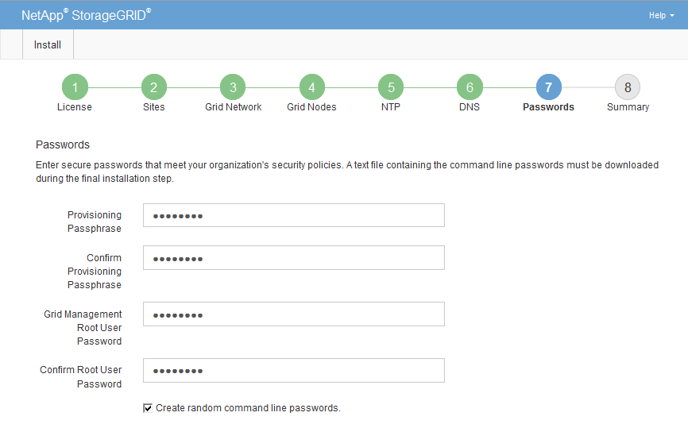

= Specifying the StorageGRID system passwords
:icons: font
:imagesdir: ../media/

[.lead]
As part of installing your StorageGRID system, you need to enter the passwords to use to secure your system and perform maintenance tasks.

.About this task

Use the Install passwords page to specify the provisioning passphrase and the grid management root user password.

* The provisioning passphrase is used as an encryption key and is not stored by the StorageGRID system.
* You must have the provisioning passphrase for installation, expansion, and maintenance procedures, including downloading the recovery package. Therefore, it is important that you store the provisioning passphrase in a secure location.
* You can change the provisioning passphrase from the Grid Manager if you have the current one.
* The grid management root user password may be changed using the Grid Manager.
* Randomly generated command line console and SSH passwords are stored in the Passwords.txt file in the recovery package.

.Steps

. In *Provisioning Passphrase*, enter the provisioning passphase that will be required to make changes to the grid topology of your StorageGRID system.
+
Store the provisioning passphrase in a secure place.
+
NOTE: If after the installation completes and you want to change the provisioning passphrase later, you can use the Grid Manager. Select *Configuration* > *Access Control* > *Grid Passwords*.

. In *Confirm Provisioning Passphrase*, reenter the provisioning passphrase to confirm it.
. In *Grid Management Root User Password*, enter the password to use to access the Grid Manager as the "`root`" user.
+
Store the password in a secure place.

. In *Confirm Root User Password*, reenter the Grid Manager password to confirm it.
+

. If you are installing a grid for proof of concept or demo purposes, optionally deselect the *Create random command line passwords* check box.
+
For production deployments, random passwords should always be used for security reasons. Deselect *Create random command line passwords* only for demo grids if you want to use default passwords to access grid nodes from the command line using the "`root`" or "`admin`" account.
+
IMPORTANT: You are prompted to download the Recovery Package file (`sgws-recovery-package-id-revision.zip`) after you click *Install* on the Summary page. You must download this file to complete the installation. The passwords required to access the system are stored in the Passwords.txt file, contained in the Recovery Package file.

. Click *Next*.
