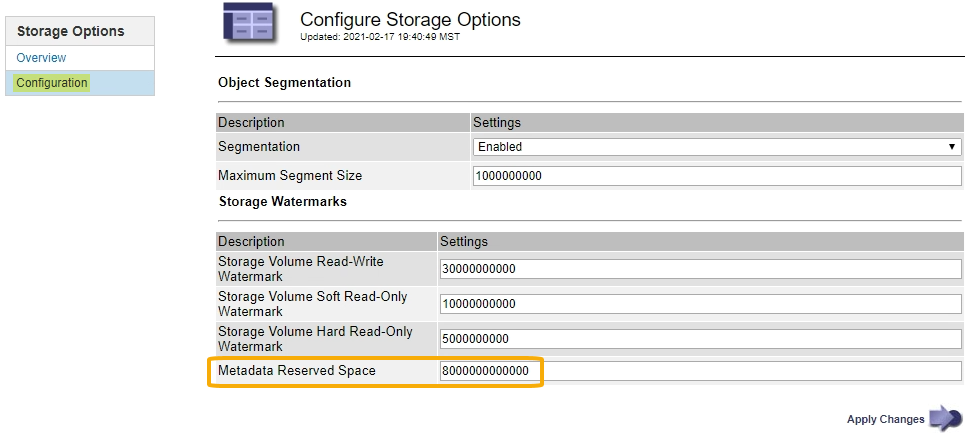

= Increase Metadata Reserved Space setting
:icons: font
:imagesdir: ../media/

[.lead]
After you upgrade to StorageGRID 11.6, you might be able to increase the Metadata Reserved Space system setting if your Storage Nodes meet specific requirements for RAM and available space.

.What you'll need
* You must be signed in to the Grid Manager using a xref:../admin/web-browser-requirements.adoc[supported web browser].
* You must have the Root Access permission or the Grid Topology Page Configuration and Other Grid Configuration permissions.
* You have completed the StorageGRID 11.6 upgrade.

.About this task

You might be able to manually increase the system-wide Metadata Reserved Space setting up to 8 TB after upgrading to StorageGRID 11.6. Reserving additional metadata space after the 11.6 upgrade will simplify future hardware and software upgrades.

You can only increase the value of the system-wide Metadata Reserved Space setting if both of these statements are true:

* The Storage Nodes at any site in your system each have 128 GB or more RAM.
* The Storage Nodes at any site in your system each have sufficient available space on storage volume 0.

Be aware that if you increase this setting, you will simultaneously reduce the space available for object storage on storage volume 0 of all Storage Nodes. For this reason, you might prefer to set the Metadata Reserved Space to a value smaller than 8 TB, based on your expected object metadata requirements.

NOTE: In general, it is better to use a higher value instead of a lower value. If the Metadata Reserved Space setting is too large, you can decrease it later. In contrast, if you increase the value later, the system might need to move object data to free up space.

For a detailed explanation of how the Metadata Reserved Space setting affects the allowed space for object metadata storage on a particular Storage Node, go to xref:../admin/managing-object-metadata-storage.adoc[Manage object metadata storage].

.Steps
. Sign in to the Grid Manager using a xref:../admin/web-browser-requirements.adoc[supported web browser].
. Determine the current Metadata Reserved Space setting.
 .. Select *CONFIGURATION* > *System* > *Storage options*.
 .. In the Storage Watermarks section, note the value of *Metadata Reserved Space*.
. Ensure you have enough available space on storage volume 0 of each Storage Node to increase this value.
 .. Select *NODES*.
 .. Select the first Storage Node in the grid.
 .. Select the Storage tab.
 .. In the Volumes section, locate the */var/local/rangedb/0* entry.
 .. Confirm that the Available value is equal to or greater than difference between the new value you want to use and the current Metadata Reserved Space value.
+
For example, if the Metadata Reserved Space setting is currently 4 TB and you want to increase it to 6 TB, the Available value must be 2 TB or greater.

 .. Repeat these steps for all Storage Nodes.
  *** If one or more Storage Nodes do not have enough available space, the Metadata Reserved Space value cannot be increased. Do not continue with this procedure.
  *** If each Storage Node has enough available space on volume 0, go to the next step.
. Ensure you have at least 128 GB of RAM on each Storage Node.
 .. Select *NODES*.
 .. Select the first Storage Node in the grid.
 .. Select the *Hardware* tab.
 .. Hover your cursor over the Memory Usage chart. Ensure that *Total Memory* is at least 128 GB.
 .. Repeat these steps for all Storage Nodes.
  *** If one or more Storage Nodes do not have enough available total memory, the Metadata Reserved Space value cannot be increased. Do not continue with this procedure.
  *** If each Storage Node has at least 128 GB of total memory, go to the next step.
. Update the Metadata Reserved Space setting.
 .. Select *CONFIGURATION* > *System* > *Storage options*.
 .. Select the Configuration tab.
 .. In the Storage Watermarks section, select *Metadata Reserved Space*.
 .. Enter the new value.
+
For example, to enter 8 TB, which is the maximum supported value, enter *8000000000000* (8, followed by 12 zeros)
+

 .. Select *Apply Changes*.
