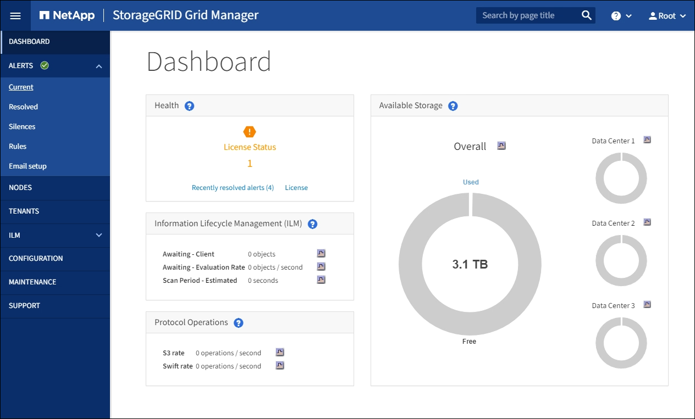

= Perform the upgrade
:icons: font
:imagesdir: ../media/

[.lead]
When you are ready to perform the upgrade, you select the `.upgrade` archive and enter the provisioning passphrase. As an option, you can run the upgrade prechecks before performing the actual upgrade.

.What you'll need
You have reviewed all of the considerations and completed all of the planning and preparation steps.

== Upload the upgrade file

. Sign in to the Grid Manager using a xref:../admin/web-browser-requirements.adoc[supported web browser].
. Select *Maintenance* > *System* > *Software Update*.
+
The Software Update page appears.

. Select *StorageGRID Upgrade*.

. On the StorageGRID Upgrade page, select the `.upgrade` archive.
 .. Select *Browse*.
 .. Locate and select the file: `NetApp_StorageGRID_11.6.0_Software_uniqueID.upgrade`
 .. Select *Open*.
+
The file is uploaded and validated. When the validation process is done, a green checkmark appears next to the upgrade file name.
. Enter the provisioning passphrase in the text box.
+
The *Run Prechecks* and *Start Upgrade* buttons become enabled.
+
image::../media/storagegrid_upgrade_buttons_enabled.png[StorageGRID Upgrade Buttons Enabled]

== Run prechecks

Optionally, you can validate the condition of your system before you start the actual upgrade. Selecting *Run Prechecks* allows you to detect and resolve issues before starting the upgrade. The same prechecks are performed when you start the upgrade. Precheck failures will stop the upgrade process and some might require technical support involvement to resolve.

. Select *Run Prechecks*. 
. Wait for the prechecks to complete.
. Follow the instructions to resolve any precheck errors that are reported.
+
IMPORTANT: If you have opened any custom firewall ports, you are notified during the precheck validation. You must contact technical support before proceeding with the upgrade.

== Start upgrade and update primary Admin Node
When the upgrade starts, upgrade prechecks are performed, and the primary Admin Node is upgraded, which includes stopping services, upgrading the software, and restarting services. You cannot access the Grid Manager while the primary Admin Node is being upgraded. Audit logs will also be unavailable. This upgrade can take up to 30 minutes.

. When you are ready to perform the upgrade, select *Start Upgrade*.
+
A warning appears to remind you that your browser's connection will be lost when the primary Admin Node is rebooted.
+
image::../media/software_upgrade_connection_will_be_lost.png[Software Upgrade Connection Will Be Lost]

. Select *OK* to acknowledge the warning and start the upgrade process.

. Wait for the upgrade prechecks to be performed and for the primary Admin Node to be upgraded. 
+
NOTE: If any precheck errors are reported, resolve them and select *Start Upgrade* again.
+
While the primary Admin Node is being upgraded, multiple *503: Service Unavailable* and *Problem connecting to the server* messages appear, which you can ignore.
+
image::../media/software_upgrade_503_error.png[Software Upgrade 503 Error]
+
image::../media/software_upgrade_problem_connecting_error.png[Software Upgrade Problem Connecting Error]

. When you see the *400: Bad Request* message, go to the next step. The Admin Node upgrade is complete.
+
image::../media/software_upgrade_400_error.png[Software Upgrade 400 Error]

== Clear browser cache and sign back in

. After the primary Admin Node has been upgraded, clear your web browser's cache and sign back in.
+
For instructions, see the documentation for your web browser.
+
IMPORTANT: You must clear the web browser's cache to remove outdated resources used by the previous version of the software.
+
The redesigned Grid Manager interface appears, which indicates that the primary Admin Node has been upgraded.
+

. From the sidebar, select *MAINTENANCE* to open the Maintenance menu.

. In the *System* section, select  *Software update*.

. In the *StorageGRID Upgrade* section, select *Upgrade*.

. Review the Upgrade Progress section on the StorageGRID Upgrade page, which provides information about each major upgrade task.
 .. *Start Upgrade Service* is the first upgrade task. During this task, the software file is distributed to the grid nodes, and the upgrade service is started.
 .. When the *Start Upgrade Service* task is complete, the *Upgrade Grid Nodes* task starts.
 .. While the *Upgrade Grid Nodes* task is in progress, the Grid Node Status table appears and shows the upgrade stage for each grid node in your system.

== Download Recovery Package and upgrade all grid nodes

. After the grid nodes appear in the Grid Node Status table, but before approving any grid nodes, xref:obtaining-required-materials-for-software-upgrade.adoc#download-the-recovery-package[download a new copy of the Recovery Package].
+
IMPORTANT: You must download a new copy of the Recovery Package file after you upgrade the software version on the primary Admin Node. The Recovery Package file allows you to restore the system if a failure occurs.

. Review the information in the Grid Node Status table. Grid nodes are arranged in sections by type: Admin Nodes, API Gateway Nodes, Storage Nodes, and Archive Nodes.
+
image::../media/software_upgrade_start_grid_node_status.png[screenshot of Upgrade Grid Nodes after Admin Node done]
+
A grid node can be in one of these stages when this page first appears:

 ** Done (primary Admin Node only)
 ** Preparing upgrade
 ** Software download queued
 ** Downloading
 ** Waiting for you to approve

. Approve the grid nodes you are ready to add to the upgrade queue. 
+
IMPORTANT: When the upgrade starts on a grid node, the services on that node are stopped. Later, the grid node is rebooted. To avoid service interruptions for client applications that are communicating with the node, do not approve the upgrade for a node unless you are sure that node is ready to be stopped and rebooted. As required, schedule a maintenance window or notify customers. 
+
You must upgrade all grid nodes in your StorageGRID system, but you can customize the upgrade sequence. You can approve individual grid nodes, groups of grid nodes, or all grid nodes.
+
If the order in which nodes are upgraded is important, approve nodes or groups of nodes one at a time and wait until the upgrade is complete on each node before approving the next node or group of nodes.
+

 ** Select one or more *Approve* buttons to add one or more individual nodes to the upgrade queue. If you approve more than one node of the same type, the nodes will be upgraded one at a time.

 ** Select the *Approve All* button within each section to add all nodes of the same type to the upgrade queue.

 ** Select the top-level *Approve All* button to add all nodes in the grid to the upgrade queue.

** Select *Remove* or *Remove All* to remove a node or all nodes from the upgrade queue. You cannot remove a node when its Stage reaches *Stopping services*. The *Remove* button is hidden.
+
image::../media/software_upgrade_two_nodes_queued.png[screen shot showing Stage is Stopping services]

. Wait for each node to proceed through the upgrade stages, which include Queued, Stopping services, Stopping container, Cleaning up Docker images, Upgrading base OS packages, Rebooting, Performing steps after reboot, Starting services, and Done.
+
NOTE: When an appliance node reaches the Upgrading base OS packages stage, the StorageGRID Appliance Installer software on the appliance is updated. This automated process ensures that the StorageGRID Appliance Installer version remains in sync with the StorageGRID software version.

== Complete upgrade

When all grid nodes have completed the upgrade stages, the *Upgrade Grid Nodes* task is shown as Completed. The remaining upgrade tasks are performed automatically and in the background.

. As soon as the *Enable Features* task is complete (which occurs quickly), optionally start using the new features in the upgraded StorageGRID version.

. During the *Upgrade Database* task, the upgrade process checks each node to verify that the Cassandra database does not need to be updated.
+
NOTE: The upgrade from StorageGRID 11.5 to 11.6 does not require a Cassandra database upgrade; however, the Cassandra service will be stopped and restarted on each Storage Node. For future StorageGRID feature releases, the Cassandra database update step might take several days to complete.

. When the *Upgrade Database* task has completed, wait a few minutes for the *Final Upgrade Steps* task to complete.
+
When the Final Upgrade Steps task has completed, the upgrade is done.

== Confirm upgrade

. Confirm that the upgrade completed successfully.

 .. From the top of the Grid Manager, select the help icon and select *About*.
 .. Confirm that the displayed version is what you would expect.
 .. Select *MAINTENANCE* > *System* > *Software update*. 
 .. In the *StorageGRID upgrade* section, select *Upgrade*.
 .. Confirm that the green banner shows that the software upgrade was completed on the date and time you expect.
+
image::../media/software_upgrade_done.png[Software Upgrade Done]

. From the StorageGRID Upgrade page, determine if any hotfixes are available for the current StorageGRID version.
+
NOTE: If no Update Path is shown, your browser might not be able to reach the NetApp Support Site. Or, the *Check for software updates* check box on the AutoSupport page (*SUPPORT* > *Tools* > *AutoSupport*) might be disabled.

. If a hotfix is available, download the file. Then, use the xref:../maintain/storagegrid-hotfix-procedure.adoc[StorageGRID hotfix procedure] to apply the  hotfix.

. Verify that grid operations have returned to normal:
 .. Check that the services are operating normally and that there are no unexpected alerts.
 .. Confirm that client connections to the StorageGRID system are operating as expected.

