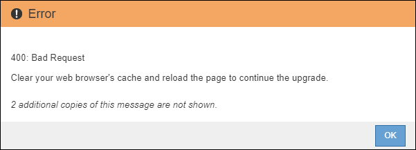

= Starting the upgrade
:icons: font
:imagesdir: ../media/

[.lead]
When you are ready to perform the upgrade, you select the downloaded file and enter the provisioning passphrase. As an option, you can run the upgrade prechecks before performing the actual upgrade.

You have reviewed all of the considerations and completed all of the steps in "`Upgrade planning and preparation.`"

. Sign in to the Grid Manager using a supported browser.
. Select *Maintenance* > *System* > *Software Update*.
+
The Software Update page appears.

. Select *StorageGRID Upgrade*.
+
The StorageGRID Upgrade page appears and shows the date and time of the most recently completed upgrade, unless the primary Admin Node has been rebooted or the management API restarted since that upgrade was performed.

. Select the .upgrade file you downloaded.
 .. Select *Browse*.
 .. Locate and select the file: NetApp_StorageGRID_version_Software_uniqueID.upgrade
 .. Select *Open*.
+
The file is uploaded and validated. When the validation process is done, a green checkmark appears next to the upgrade file name.
. Enter the provisioning passphrase in the text box.
+
The *Run Prechecks* and *Start Upgrade* buttons become enabled.
+
image::../media/storagegrid_upgrade_buttons_enabled.png[StorageGRID Upgrade Buttons Enabled]

. If you want to validate the condition of your system before you start the actual upgrade, select *Run Prechecks*. Then, resolve any precheck errors that are reported.
+
IMPORTANT: If you have opened any custom firewall ports, you are notified during the precheck validation. You must contact technical support before proceeding with the upgrade.
+
NOTE: The same prechecks are performed when you select *Start Upgrade*. Selecting *Run Prechecks* allows you to detect and resolve issues before starting the upgrade.

. When you are ready to perform the upgrade, select *Start Upgrade*.
+
A warning appears to remind you that your browser's connection will be lost when the primary Admin Node is rebooted. When the primary Admin Node is available again, you need to clear your web browser's cache and reload the Software Upgrade page.
+
image::../media/software_upgrade_connection_will_be_lost.png[Software Upgrade Connection Will Be Lost]

. Select *OK* to acknowledge the warning and start the upgrade process.
+
When the upgrade starts:

 .. The upgrade prechecks are run.
+
NOTE: If any precheck errors are reported, resolve them and select *Start Upgrade* again.

 .. The primary Admin Node is upgraded, which includes stopping services, upgrading the software, and restarting services. You will not be able to access the Grid Manager while the primary Admin Node is being upgraded. Audit logs will also be unavailable. This upgrade can take up to 30 minutes.
+
NOTE: While the primary Admin Node is being upgraded, multiple copies of the following error messages appear, which you can ignore.
+
image::../media/software_upgrade_problem_connecting_error.png[Software Upgrade Problem Connecting Error]
+
image::../media/software_upgrade_503_error.png[Software Upgrade 503 Error]
+

. After the primary Admin Node has been upgraded, clear your web browser's cache, sign back in, and reload the Software Upgrade page.
+
For instructions, see the documentation for your web browser.
+
IMPORTANT: You must clear the web browser's cache to remove outdated resources used by the previous version of the software.

*Related information*

xref:concept_upgrade_planning_and_preparation.adoc[Upgrade planning and preparation]
