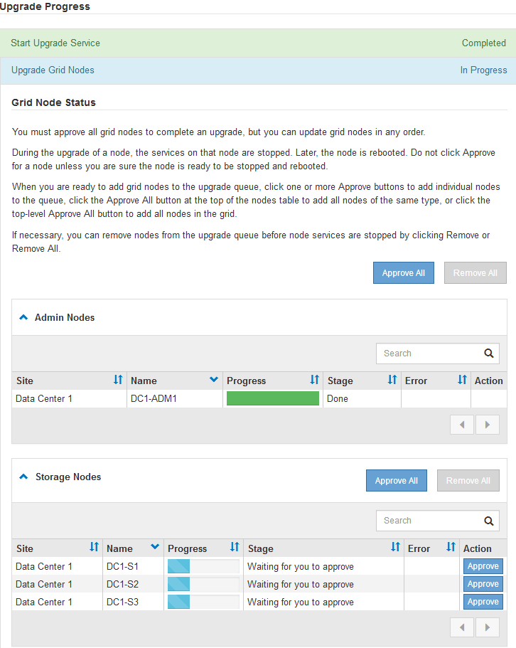
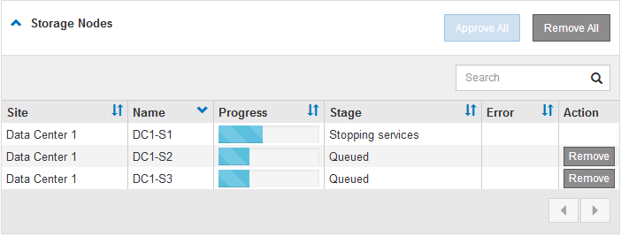
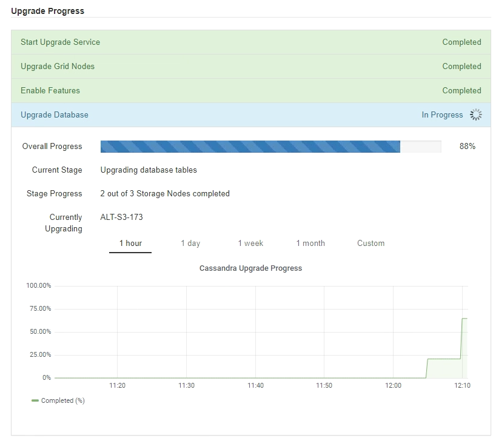
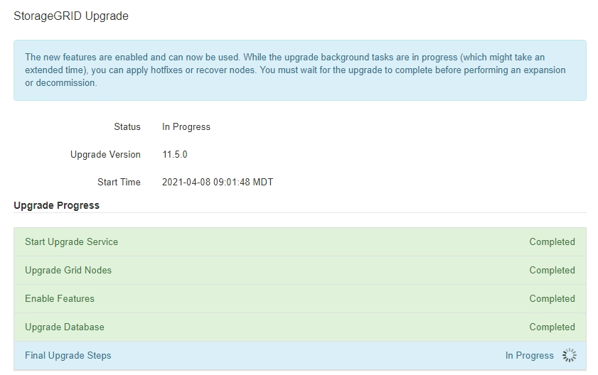

= Upgrading grid nodes and completing the upgrade
:icons: font
:imagesdir: ../media/

[.lead]
After the primary Admin Node has been upgraded, you must upgrade all other grid nodes in your StorageGRID system. You can customize the upgrade sequence by selecting to upgrade individual grid nodes, groups of grid nodes, or all grid nodes.

.Steps
. Review the Upgrade Progress section on the Software Upgrade page, which provides information about each major upgrade task.
 .. *Start Upgrade Service* is the first upgrade task. During this task, the software file is distributed to the grid nodes, and the upgrade service is started.
 .. When the *Start Upgrade Service* task is complete, the *Upgrade Grid Nodes* task starts.
 .. While the *Upgrade Grid Nodes* task is in progress, the Grid Node Status table appears and shows the upgrade stage for each grid node in your system.
. After the grid nodes appear in the Grid Node Status table, but before approving any grid nodes, download a new copy of the Recovery Package.
+
IMPORTANT: You must download a new copy of the Recovery Package file after you upgrade the software version on the primary Admin Node. The Recovery Package file allows you to restore the system if a failure occurs.

. Review the information in the Grid Node Status table. Grid nodes are arranged in sections by type: Admin Nodes, API Gateway Nodes, Storage Nodes, and Archive Nodes.
+

+
A grid node can be in one of these stages when this page first appears:

 ** Done (primary Admin Node only)
 ** Preparing upgrade
 ** Software download queued
 ** Downloading
 ** Waiting for you to approve

. Approve the grid nodes you are ready to add to the upgrade queue. Approved nodes of the same type are upgraded one at a time.
+
If the order in which nodes are upgraded is important, approve nodes or groups of nodes one at a time and wait until the upgrade is complete on each node before approving the next node or group of nodes.
+
IMPORTANT: When the upgrade starts on a grid node, the services on that node are stopped. Later, the grid node is rebooted. These operations might cause service interruptions for clients that are communicating with the node. Do not approve the upgrade for a node unless you are sure that node is ready to be stopped and rebooted.

 ** Select one or more *Approve* buttons to add one or more individual nodes to the upgrade queue.
 ** Select the *Approve All* button within each section to add all nodes of the same type to the upgrade queue.
 ** Select the top-level *Approve All* button to add all nodes in the grid to the upgrade queue.

. If you need to remove a node or all nodes from the upgrade queue, select *Remove* or *Remove All*.
+
As shown in the example, when the Stage reaches *Stopping services*, the *Remove* button is hidden and you can no longer remove the node.
+

. Wait for each node to proceed through the upgrade stages, which include Queued, Stopping services, Stopping container, Cleaning up Docker images, Upgrading base OS packages, Rebooting, and Starting services.
+
NOTE: When an appliance node reaches the Upgrading base OS packages stage, the StorageGRID Appliance Installer software on the appliance is updated. This automated process ensures that the StorageGRID Appliance Installer version remains in sync with the StorageGRID software version.
+
When all grid nodes have been upgraded, the *Upgrade Grid Nodes* task is shown as Completed. The remaining upgrade tasks are performed automatically and in the background.

. As soon as the *Enable Features* task is complete (which occurs quickly), you can start using the new features in the upgraded StorageGRID version.
+
For example, if you are upgrading to StorageGRID 11.5, you can now enable S3 Object Lock, configure a key management server, or increase the Metadata Reserved Space setting.
+
xref:increasing_metadata_reserved_space_setting.adoc[Increasing the Metadata Reserved Space setting]

. Periodically monitor the progress of the *Upgrade Database* task.
+
During this task, the Cassandra database is upgraded on each Storage Node.
+
NOTE: The *Upgrade Database* task might take days to complete. As this background task runs, you can apply hotfixes or recover nodes. However, you must wait for the *Final Upgrade Steps* task to complete before performing an expansion or decommission procedure.
+
You can review the graph to monitor the progress for each Storage Node.
+

. When the *Upgrade Database* task has completed, wait a few minutes for the *Final Upgrade Steps* task to complete.
+

+
When the Final Upgrade Steps task has completed, the upgrade is done.

. Confirm that the upgrade completed successfully.
 .. Sign in to the Grid Manager using a supported browser.
 .. Select *Help* > *About*.
 .. Confirm that the displayed version is what you would expect.
 .. Select *Maintenance* > *System* > *Software Update*. Then, select *StorageGRID Upgrade*.
 .. Confirm that the green banner shows that the software upgrade was completed on the date and time you expected.
+
image::../media/software_upgrade_done.png[Software Upgrade Done]
. Verify that grid operations have returned to normal:
 .. Check that the services are operating normally and that there are no unexpected alerts.
 .. Confirm that client connections to the StorageGRID system are operating as expected.
. Check the NetApp Downloads page for StorageGRID to see if any hotfixes are available for the StorageGRID version that you just installed.
+
https://mysupport.netapp.com/site/products/all/details/storagegrid/downloads-tab[NetApp Downloads: StorageGRID]
+
In the StorageGRID 11.5._x.y_ version number:

 ** The major release has an _x_ value of 0 (11.5.0).
 ** A minor release, if available, has an _x_ value other than 0 (for example, 11.5.1).
 ** A hotfix, if available, has a _y_ value (for example, 11.5.0.1).

. If available, download and apply the latest hotfix for your StorageGRID version.
+
See the recovery and maintenance instructions for information about applying hotfixes.

.Related information

xref:downloading_recovery_package.adoc[Downloading the Recovery Package]

xref:../maintain/index.adoc[Maintain & recover]
