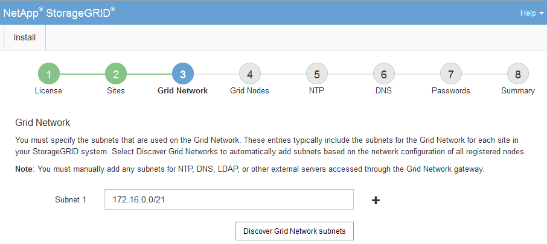

= Specifying Grid Network subnets
:icons: font
:imagesdir: ../media/

[.lead]
You must specify the subnets that are used on the Grid Network.

.About this task

The subnet entries include the subnets for the Grid Network for each site in your StorageGRID system, along with any subnets that need to be reachable via the Grid Network.

If you have multiple grid subnets, the Grid Network gateway is required. All grid subnets specified must be reachable through this gateway.

.Steps

. Specify the CIDR network address for at least one Grid Network in the *Subnet 1* text box.
. Click the plus sign next to the last entry to add an additional network entry.
+
If you have already deployed at least one node, click *Discover Grid Networks Subnets* to automatically populate the Grid Network Subnet List with the subnets reported by grid nodes that have registered with the Grid Manager.
+

. Click *Next*.
