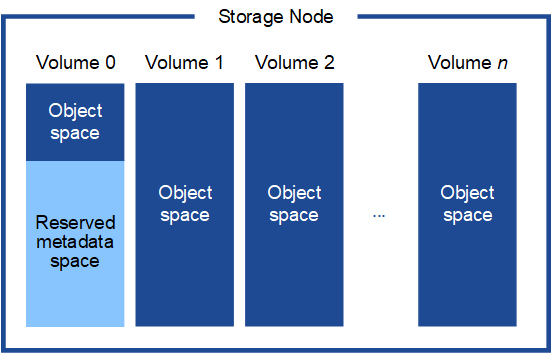

= Storage and performance requirements
:icons: font
:imagesdir: ../media/

[.lead]
You must understand the storage and performance requirements for StorageGRID nodes hosted by virtual machines, so you can provide enough space to support the initial configuration and future storage expansion.

== Performance requirements

The performance of the OS volume and of the first storage volume significantly impacts the overall performance of the system. Ensure that these provide adequate disk performance in terms of latency, input/output operations per second (IOPS), and throughput.

All StorageGRID nodes require that the OS drive and all storage volumes have write-back caching enabled. The cache must be on a protected or persistent media.

== Requirements for virtual machines that use NetApp AFF storage

If you are deploying a StorageGRID node as a virtual machine with storage assigned from a NetApp AFF system, you have confirmed that the volume does not have a FabricPool tiering policy enabled. For example, if a StorageGRID node is running as an virtual machine on a VMWare host, ensure the volume backing the datastore for the node does not have a FabricPool tiering policy enabled. Disabling FabricPool tiering for volumes used with StorageGRID nodes simplifies troubleshooting and storage operations.

IMPORTANT: Never use FabricPool to tier any data related to StorageGRID back to StorageGRID itself. Tiering StorageGRID data back to StorageGRID increases troubleshooting and operational complexity.

== Number of virtual machines required

Each StorageGRID site requires a minimum of three Storage Nodes.

IMPORTANT: In a production deployment, do not run more than one Storage Node on a single virtual machine server. Using a dedicated virtual machine host for each Storage Node provides an isolated failure domain.

Other types of nodes, such as Admin Nodes or Gateway Nodes, can be deployed on the same virtual machine host, or they can be deployed on their own dedicated virtual machine hosts as required. However, if you have multiple nodes of the same type (two Gateway Nodes, for example), do not install all instances on the same virtual machine host.

== Storage requirements by node type

In a production environment, the virtual machines for StorageGRID grid nodes must meet different requirements, depending on the types of nodes.

NOTE: Disk snapshots cannot be used to restore grid nodes. Instead, refer to the recovery and maintenance procedures for each type of node.

[cols="1a,2a" options="header"]
|===
| Node Type| Storage
|Admin Node
|100 GB LUN for OS

200 GB LUN for Admin Node tables

200 GB LUN for Admin Node audit log

|Storage Node
|100 GB LUN for OS

3 LUNs for each Storage Node on this host

*Note*: A Storage Node can have 1 to 16 storage LUNs; at least 3 storage LUNs are recommended.

Minimum size per LUN: 4 TB

Maximum tested LUN size: 39 TB.

|Gateway Node
|100 GB LUN for OS

|Archive Node
|100 GB LUN for OS
|===

IMPORTANT: Depending on the audit level configured, the size of user inputs such as S3 object key name, and how much audit log data you need to preserve, you might need to increase the size of the audit log LUN on each Admin Node. As a general rule, a grid generates approximately 1 KB of audit data per S3 operation, which would mean that a 200 GB LUN would support 70 million operations per day or 800 operations per second for two to three days.

== Storage requirements for Storage Nodes

A software-based Storage Node can have 1 to 16 storage volumes--3 or more storage volumes are recommended. Each storage volume should be 4 TB or larger.

NOTE: An appliance Storage Node can have up to 48 storage volumes.

As shown in the figure, StorageGRID reserves space for object metadata on storage volume 0 of each Storage Node. Any remaining space on storage volume 0 and any other storage volumes in the Storage Node are used exclusively for object data.

To provide redundancy and to protect object metadata from loss, StorageGRID stores three copies of the metadata for all objects in the system at each site. The three copies of object metadata are evenly distributed across all Storage Nodes at each site.

When you assign space to volume 0 of a new Storage Node, you must ensure there is adequate space for that node's portion of all object metadata.

* At a minimum, you must assign at least 4 TB to volume 0.
+
NOTE: If you use only one storage volume for a Storage Node and you assign 4 TB or less to the volume, the Storage Node might enter the Storage Read-Only state on startup and store object metadata only.

* If you are installing a new StorageGRID 11.5 system and each Storage Node has 128 GB or more of RAM, you should assign 8 TB or more to volume 0. Using a larger value for volume 0 can increase the space allowed for metadata on each Storage Node.
* When configuring different Storage Nodes for a site, use the same setting for volume 0 if possible. If a site contains Storage Nodes of different sizes, the Storage Node with the smallest volume 0 will determine the metadata capacity of that site.

For details, go to the instructions for administering StorageGRID and search for "`managing object metadata storage.`"

xref:../admin/index.adoc[Administer StorageGRID]

.Related information

xref:../maintain/index.adoc[Maintain & recover]
